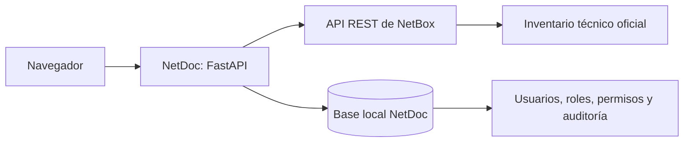
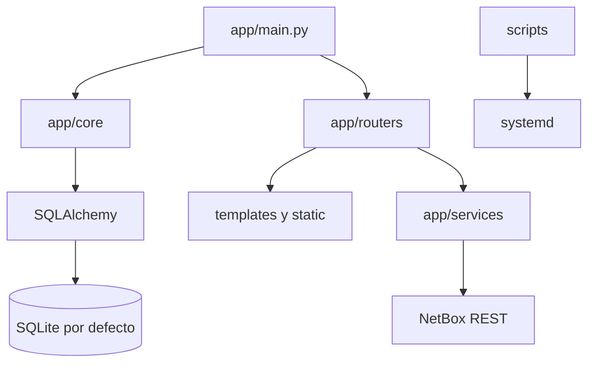

# Arquitectura

## Propósito, alcance y límites

NetDoc ofrece una experiencia web para lectura y operaciones guiadas sobre el inventario de NetBox. NetBox conserva la autoridad sobre dispositivos, interfaces, racks y cables. NetDoc mantiene únicamente datos propios de la aplicación: usuarios, roles, permisos, sesiones y auditoría.

## Organización y flujos

- `app/main.py`: crea FastAPI, configura middleware, autenticación y rutas principales.
- `app/core/config.py`: carga configuración desde `.env`.
- `app/core/database.py`: motor SQLAlchemy, sesiones transaccionales e inicialización del esquema.
- `app/core/auth.py`: identidad de sesión, CSRF común y autorización por permisos.
- `app/core/security.py`: hash y verificación Argon2.
- `app/models/access.py`: entidades de usuario, rol, permiso y evento de auditoría.
- `app/services/access_service.py`: reglas de negocio del control de acceso.
- `app/routers/admin.py`: pantallas y acciones administrativas.
- `app/services/netbox_client.py` y servicios especializados: integración con NetBox.
- `app/templates` y `app/static`: presentación.
- `scripts`: despliegue operativo, sin lógica de negocio.

## Autenticación y autorización

En el arranque, NetDoc crea las tablas ausentes y carga permisos y roles iniciales. Si no existe una cuenta con `ADMIN_USERNAME`, se crea usando `ADMIN_PASSWORD_HASH`; estas variables son un mecanismo de arranque, no un reemplazo de la gestión de usuarios.

Tras validar la contraseña Argon2, la sesión almacena ID de usuario, nombre, rol y conjunto de permisos. `PermissionMiddleware` protege rutas HTML y API. Las rutas administrativas realizan además verificaciones explícitas y CSRF. La navegación oculta opciones que el rol no puede usar, pero la seguridad real permanece en el servidor.

Roles iniciales:

- **Administrador:** todos los permisos y gestión completa.
- **Operador:** consulta y operaciones guiadas de dispositivos y conexiones.
- **Consulta:** acceso de solo lectura a dashboard, dispositivos, conexiones y racks.

## Persistencia

`DATABASE_URL` selecciona la base de datos. El valor predeterminado es `sqlite:///./data/netdoc.db`; desarrollo y producción deben conservar bases independientes. El archivo local y el directorio `data/` no se versionan. SQLAlchemy permite migrar más adelante a PostgreSQL sin cambiar el modelo de dominio.

La primera entrega usa `Base.metadata.create_all()` para establecer el esquema inicial. Esta decisión solo cubre el primer despliegue; cualquier evolución posterior de tablas requiere migraciones versionadas con Alembic.

## Auditoría

Los eventos registran fecha, usuario, acción, recurso, identificador, resultado, descripción, IP y agente del navegador. Se registran accesos correctos y fallidos, cierre de sesión, administración de usuarios y roles, y solicitudes de creación de dispositivos o conexiones. Nunca deben incluirse contraseñas, hashes, tokens ni contenido de `.env`.

## Integración con NetBox

El navegador solicita una ruta, FastAPI valida sesión y permiso, el router usa un servicio y este consulta NetBox; la respuesta se presenta en Jinja2. La creación guiada de equipos y cables requiere autenticación, permiso, CSRF y `NETBOX_WRITE_ENABLED=true`. NetBox conserva las validaciones finales y el historial técnico.

## Dependencias y operación

Dependencias principales: Python, FastAPI, Jinja2, HTTPX, Pydantic Settings, SessionMiddleware, Argon2, SQLAlchemy y Uvicorn. La disponibilidad depende de FastAPI, systemd, la base de identidad y NetBox. La aplicación actual usa un único proceso Uvicorn por entorno; si aumenta la concurrencia se debe reevaluar SQLite y la estrategia de workers.

## Limitaciones y trabajo futuro

- Falta prueba integral del módulo en el servidor de desarrollo.
- Las sesiones de otros usuarios no se actualizan en vivo cuando cambia un rol; deben iniciar sesión nuevamente.
- Falta exportación de auditoría, retención configurable y manejo centralizado de errores.
- Antes de cambiar el esquema debe incorporarse Alembic.
- Continúan planificados búsqueda global, edición controlada, patch panels, topologías, 3D y observabilidad.
