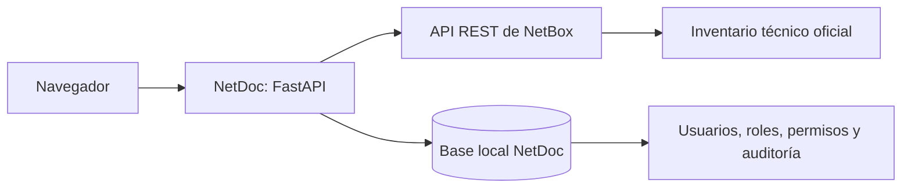
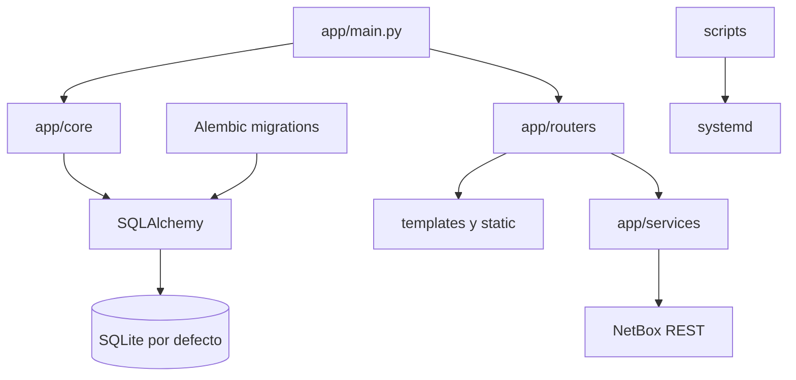

# Arquitectura

## Propósito, alcance y límites

NetDoc ofrece una experiencia web para lectura y operaciones guiadas sobre el inventario de NetBox. NetBox conserva la autoridad sobre dispositivos, interfaces, racks, sitios y cables. NetDoc mantiene únicamente datos propios de la aplicación: usuarios, roles, permisos y auditoría.

## Organización y flujos

- `app/main.py`: crea FastAPI, configura middleware, autenticación y rutas principales.
- `app/core/config.py`: carga configuración desde `.env`.
- `app/core/database.py`: motor SQLAlchemy, sesiones transaccionales e inicialización de la base.
- `app/core/migrations.py`: crea, adopta o actualiza el esquema mediante Alembic.
- `app/core/auth.py`: identidad de sesión, CSRF común y autorización por permisos.
- `app/core/security.py`: hash y verificación Argon2.
- `app/models/access.py`: entidades de usuario, rol, permiso y evento de auditoría.
- `app/services/access_service.py`: reglas de negocio del control de acceso y protección de login.
- `app/routers/admin.py`: pantallas y acciones administrativas.
- `app/routers/sites.py`: catálogo y operaciones controladas sobre Sites.
- `app/services/site_service.py`: validación e integración de Sites con NetBox.
- `app/routers/profile.py`: perfil y cambio de contraseña propios.
- `app/services/netbox_client.py` y servicios especializados: integración con NetBox.
- `app/services/search_service.py`: búsqueda concurrente y normalización de resultados.
- `app/services/system_service.py`: métricas no privilegiadas del host y del proceso.
- `app/routers/search.py` y `app/routers/system.py`: vistas y API JSON de búsqueda y salud.
- `migrations/versions`: historial versionado del esquema local.
- `app/templates` y `app/static`: presentación.
- `scripts`: despliegue operativo, sin lógica de negocio.

## Autenticación y autorización

En el arranque, NetDoc actualiza primero el esquema hasta la revisión Alembic vigente y después carga permisos, roles iniciales y el administrador de arranque. Si no existe una cuenta con `ADMIN_USERNAME`, se crea usando `ADMIN_PASSWORD_HASH`; estas variables no sustituyen la gestión normal de usuarios.

Tras validar la contraseña Argon2, la sesión almacena el identificador del usuario y una copia de presentación de su rol y permisos. Antes de atender cada ruta protegida, `PermissionMiddleware` vuelve a consultar la identidad activa en la base y actualiza esos datos de sesión. Como resultado:

- una cuenta desactivada pierde acceso en la siguiente solicitud;
- un cambio de rol o permisos se aplica en la siguiente solicitud;
- una cuenta eliminada debe autenticarse nuevamente;
- un fallo al cargar identidad se trata de forma cerrada y devuelve al login.

Las rutas administrativas y el perfil realizan además verificaciones explícitas y CSRF. La navegación oculta opciones que el rol no puede usar, pero la seguridad real permanece en el servidor.

Roles iniciales:

- **Administrador:** todos los permisos y gestión completa.
- **Operador:** consulta y operaciones guiadas de dispositivos y conexiones.
- **Consulta:** acceso de solo lectura a dashboard, búsqueda global, dispositivos, conexiones y racks.

Los permisos `sites.view` y `sites.manage` separan consulta y modificación. El
Administrador recibe ambos; Operador y Consulta reciben solo `sites.view` por
defecto.

## Protección de inicio de sesión

Los fallos recientes se consultan en Auditoría por nombre de usuario e IP. `LOGIN_MAX_ATTEMPTS` y `LOGIN_WINDOW_SECONDS` controlan el límite. Mientras existe bloqueo, NetDoc no verifica la contraseña, devuelve HTTP 429 con `Retry-After` y registra `LOGIN_BLOCKED` sin confirmar si la cuenta existe.

Este control es apropiado para el proceso único actual. Antes de usar varios workers, balanceadores o un proxy que oculte la IP real debe reemplazarse o complementarse con un mecanismo distribuido.

## Persistencia y migraciones

`DATABASE_URL` selecciona la base de datos. El valor predeterminado es `sqlite:///./data/netdoc.db`; desarrollo y producción deben conservar bases independientes. El archivo local y el directorio `data/` no se versionan.

La revisión inicial `20260724_0001` crea:

- `permissions`;
- `roles`;
- `role_permissions`;
- `users`;
- `audit_events`.

`ensure_database_schema()` aplica una de estas rutas:

1. Si no existen tablas del módulo de acceso, ejecuta `alembic upgrade head`.
2. Si existe `alembic_version`, actualiza hasta `head`.
3. Si existen exactamente todas las tablas heredadas, ejecuta `alembic stamp head` sin recrearlas ni borrar datos.
4. Si solo existe una parte del esquema, detiene el arranque con un error explícito.

La adopción de una base heredada supone que sus tablas corresponden al esquema completo anterior. Antes del primer despliegue debe respaldarse la base. El rollback del código no ejecuta `alembic downgrade` ni restaura el archivo de datos.

SQLite habilita claves foráneas. El diseño actual supone un único proceso Uvicorn por entorno; antes de múltiples workers o mayor concurrencia debe reevaluarse el motor, el bloqueo de login y la estrategia de migración.

## Auditoría

Los eventos registran fecha, usuario, acción, recurso, identificador, resultado, descripción, IP y agente del navegador. Se registran accesos correctos y fallidos, bloqueos, cierre de sesión, cambios de perfil, administración de usuarios y roles, eliminación de cuentas, exportaciones y solicitudes de creación de dispositivos o conexiones.

La vista permite filtrar por acción, recurso, resultado y fechas. La exportación CSV se limita a 10,000 filas y neutraliza celdas que podrían convertirse en fórmulas. Nunca deben incluirse contraseñas, hashes, tokens ni contenido de `.env`.

## Búsqueda global

`search_service` consulta en paralelo dispositivos, interfaces, racks, sitios y cables mediante el filtro `q` de NetBox. Cada sección falla de forma independiente, por lo que un endpoint no disponible no impide mostrar los demás resultados. Los enlaces conducen a vistas internas de NetDoc y la operación es siempre de solo lectura.

## Estado del sistema

`system_service` usa `os`, `shutil`, `platform`, `socket` y lecturas de `/proc` para presentar CPU, carga, memoria, disco, red y uptime. No invoca shell, `systemctl`, sudo ni comandos privilegiados. Las métricas son instantáneas o acumuladas desde el arranque y no sustituyen monitoreo histórico.

## Integración con NetBox

El navegador solicita una ruta, FastAPI valida identidad y permiso, el router usa un servicio y este consulta NetBox; la respuesta se presenta en Jinja2. La creación guiada de equipos y cables requiere autenticación, permiso, CSRF y `NETBOX_WRITE_ENABLED=true`. NetBox conserva las validaciones finales y el historial técnico.

## Dependencias y operación

Dependencias principales: Python, FastAPI, Jinja2, HTTPX, Pydantic Settings, SessionMiddleware, Argon2, SQLAlchemy, Alembic y Uvicorn. La disponibilidad depende de FastAPI, systemd, la base de identidad y NetBox.

## Limitaciones y trabajo futuro

- Falta prueba integral del módulo y de la migración en el servidor de desarrollo.
- Falta respaldo y recuperación automatizados de la base.
- Falta retención configurable y eliminación segura de auditoría.
- El fallo de base actualmente invalida la sesión en lugar de mostrar una página operativa diferenciada.
- El rate limiting distribuido y la IP real detrás de proxies requieren diseño adicional.
- Continúan planificados edición controlada de inventario, patch panels, topologías, 3D, métricas históricas y alertas.
