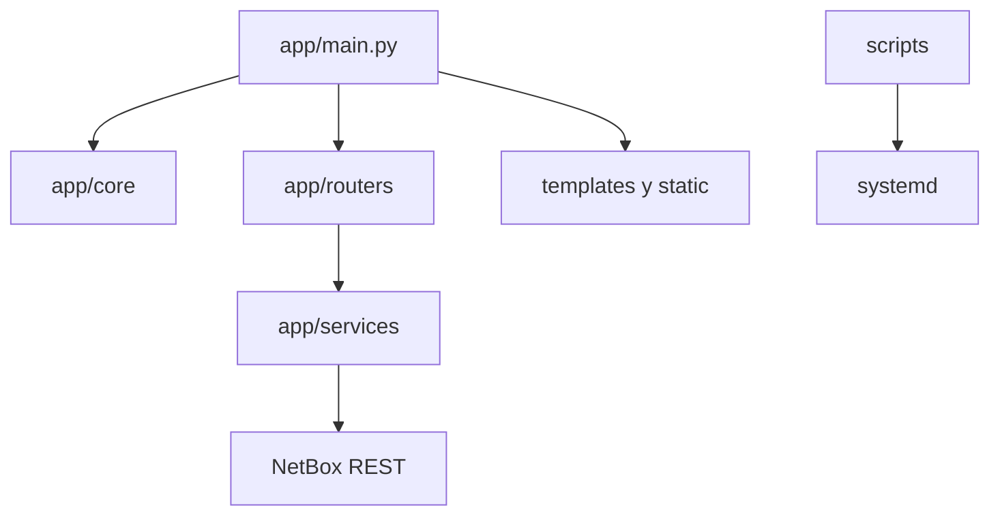

# Arquitectura

## Propósito, alcance y límites

NetDoc ofrece una experiencia web para lectura y operaciones guiadas sobre el
inventario de NetBox. No sustituye el inventario ni implementa aún usuarios,
roles, permisos o auditoría internos.

## Organización y flujos

`app/main.py` crea FastAPI, sesiones, rutas base y plantillas. `app/core`
contiene configuración y seguridad; `app/routers`, pantallas especializadas;
`app/services`, acceso y transformación de API; `templates` presentación;
`static` CSS/JavaScript; `scripts` actualizaciones operativas, no lógica web.

El navegador solicita una ruta, FastAPI comprueba sesión, el router usa un
servicio y éste consulta NetBox; la respuesta se presenta en Jinja2. La creación
guiada y cables se someten a autenticación, CSRF y a la configuración de
escritura; NetBox conserva la integridad final. Los errores de NetBox se
transforman en `NetBoxError` y vistas/mensajes específicos; no existe aún un
manejador centralizado.

## Configuración, sesiones y dependencias

Pydantic Settings carga `.env`; no se versiona. SessionMiddleware usa secreto,
cookie y opciones configurables. La autenticación actual es administrativa
inicial, con hash Argon2. Dependencias principales: Python, FastAPI, Jinja2,
HTTPX, Pydantic Settings, SessionMiddleware, Argon2 y Uvicorn.

## Futuro y consideraciones

Usuarios, roles, permisos y auditoría son Planificado y exigirán un diseño
explícito. Para escala, limitar paginación y llamadas a NetBox; disponibilidad
depende de FastAPI, systemd y NetBox. Mínimo privilegio, secretos fuera de Git y
entornos separados son requisitos. Limitaciones: sin pruebas automatizadas
identificadas, auditoría centralizada ni manejo centralizado de errores.
