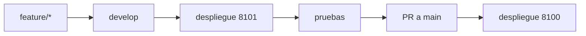

# Despliegue

## Objetivo y política

`git push` solo publica cambios en GitHub; no actualiza servidores. El comando de desarrollo descarga `origin/develop` en 8101; el de producción requiere promoción a `main` y descarga `origin/main` en 8100. No modifique producción manualmente ni despliegue automáticamente desde un PR.



## Entornos

- Producción: `/opt/netdoc-prod`, `main`, `netdoc-prod`, 8100 y `http://127.0.0.1:8100/login`.
- Desarrollo: `/opt/netdoc-dev`, `develop`, `netdoc-dev`, 8101 y `http://127.0.0.1:8101/login`.
- Usuario propietario de repositorios y entornos virtuales: `sshtelenord`.

## Prerrequisitos e instalación

En cada entorno debe existir el repositorio, `.env`, `.venv`, remoto `origin`, archivo de dependencias y servicio systemd. Las rutas del repositorio, `.git` y `.venv` deben pertenecer a `sshtelenord`.

Instale desde un checkout confiable:

```bash
install -m 750 scripts/netdoc-deploy-dev /usr/local/sbin/netdoc-deploy-dev
install -m 750 scripts/netdoc-deploy-prod /usr/local/sbin/netdoc-deploy-prod
```

Ejecute como root:

```bash
netdoc-deploy-dev
netdoc-deploy-prod
```

Producción exige escribir `DESPLEGAR`. `netdoc-deploy-prod --yes` queda reservado para automatización controlada.

## Controles previos

Los scripts:

- Adquieren un bloqueo exclusivo con `flock` por entorno.
- Verifican comandos requeridos, usuario `sshtelenord`, servicio y estructura.
- Confirman rama y remoto usando Git como `sshtelenord`.
- Rechazan cambios versionados, preparados o archivos no rastreados mediante `git status --porcelain`.
- Abortan si `.env` está versionado.
- Exigen que `.env` esté protegido por `.gitignore`.
- Validan propietarios de la ruta, `.git` y `.venv`.
- Prefieren `requirements-lock.txt` y usan `requirements.txt` como respaldo cuando sea necesario.

## Actualización y validación

Git, pip y Python se ejecutan como `sshtelenord` mediante `runuser`; `systemctl`, `curl` y `flock` se ejecutan como root.

El flujo es:

1. Guardar el commit anterior.
2. `git fetch --prune origin`.
3. Confirmar la rama remota.
4. `git reset --hard origin/<rama>`.
5. Instalar dependencias.
6. Compilar `app`.
7. Importar `app.main`.
8. Reiniciar únicamente el servicio del entorno.
9. Consultar `/login` mediante GET.
10. Aceptar HTTP 200 o cualquier 3xx.
11. Reintentar la comprobación durante al menos 30 segundos.

No se usa `git clean` y `.env` no se muestra, modifica ni elimina.

## Rollback

Ante un fallo posterior a iniciar la actualización, el script:

1. Restaura el commit anterior como `sshtelenord`.
2. Reinstala las dependencias del commit restaurado.
3. Reinicia únicamente el servicio correspondiente.
4. Repite la comprobación HTTP con reintentos.
5. Informa si algún paso requiere revisión manual.

Rollback manual:

```bash
runuser -u sshtelenord -- git -C /opt/netdoc-dev reset --hard <commit>
runuser -u sshtelenord -- /opt/netdoc-dev/.venv/bin/python -m pip install -r /opt/netdoc-dev/requirements-lock.txt
systemctl restart netdoc-dev
```

Ajuste ruta y servicio para producción. El respaldo `/opt/netbox-documental` es temporal y no es producción activa; recuperar su uso requiere una decisión formal.

## Verificación posterior

- Servicio activo.
- Rama y commit correctos.
- `/login` devuelve HTTP 200 o 3xx.
- Logs sin errores evidentes.
- Propietarios de repositorio y `.venv` siguen siendo `sshtelenord`.
- `.env` permanece presente, ignorado y no versionado.

Los scripts están versionados, pero no debe afirmarse que están instalados o probados en el servidor hasta realizar un despliegue controlado.