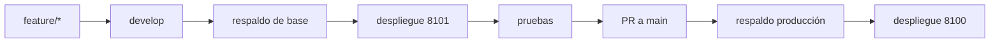

# Despliegue

## Objetivo y política

`git push` solo publica cambios en GitHub; no actualiza servidores. El comando de desarrollo descarga `origin/develop` en 8101; el de producción requiere promoción a `main` y descarga `origin/main` en 8100. No modifique producción manualmente ni despliegue automáticamente desde un PR.



## Entornos

- Producción: `/opt/netdoc-prod`, `main`, `netdoc-prod`, 8100 y `http://127.0.0.1:8100/login`.
- Desarrollo: `/opt/netdoc-dev`, `develop`, `netdoc-dev`, 8101 y `http://127.0.0.1:8101/login`.
- Usuario propietario de repositorios, entornos virtuales y base local: `sshtelenord`.

## Prerrequisitos e instalación

En cada entorno debe existir el repositorio, `.env`, `.venv`, remoto `origin`, archivo de dependencias y servicio systemd. Las rutas del repositorio, `.git`, `.venv` y la base local deben pertenecer a `sshtelenord`.

Instale desde un checkout confiable:

```bash
install -m 750 scripts/netdoc-deploy-dev /usr/local/sbin/netdoc-deploy-dev
install -m 750 scripts/netdoc-deploy-prod /usr/local/sbin/netdoc-deploy-prod
```

Ejecute como root:

```bash
netdoc-deploy-dev
netdoc-deploy-prod
```

Producción exige escribir `DESPLEGAR`. `netdoc-deploy-prod --yes` queda reservado para automatización controlada.

## Respaldo obligatorio de la base

Antes de toda migración identifique el destino real de `DATABASE_URL` sin imprimir el resto de `.env` y cree un respaldo consistente.

Desde la versión `0.10.1`, la base local puede incluir imágenes frontal y trasera de modelos. El respaldo debe abarcar el archivo o motor completo; copiar solo tablas de usuarios o auditoría perdería las imágenes.

Para SQLite puede crear un respaldo en línea con su API:

```bash
runuser -u sshtelenord -- bash -lc '
cd /opt/netdoc-dev
.venv/bin/python - <<"PY"
from datetime import datetime, timezone
from pathlib import Path
import sqlite3

source = Path("data/netdoc.db")
stamp = datetime.now(timezone.utc).strftime("%Y%m%d-%H%M%S")
target = source.with_name(f"netdoc.db.pre-migration-{stamp}")

if not source.exists():
    print("No existe una base previa; Alembic creará el esquema inicial.")
else:
    with sqlite3.connect(source) as src, sqlite3.connect(target) as dst:
        src.backup(dst)
    target.chmod(0o600)
    print(target)
PY
'
```

Cambie la ruta para producción o para otro valor de `DATABASE_URL`. Si se usa PostgreSQL u otro motor, aplique el procedimiento nativo. No copie bases entre desarrollo y producción.

Antes de continuar confirme:

- respaldo creado y legible solo por el usuario autorizado;
- tamaño del respaldo distinto de cero;
- espacio libre suficiente para la base y las imágenes;
- almacenamiento de respaldo fuera del ciclo de limpieza de la aplicación.

## Controles previos

Los scripts:

- adquieren un bloqueo exclusivo con `flock` por entorno;
- verifican comandos requeridos, usuario `sshtelenord`, servicio y estructura;
- confirman rama y remoto usando Git como `sshtelenord`;
- rechazan cambios versionados, preparados o archivos no rastreados mediante `git status --porcelain`;
- abortan si `.env` está versionado;
- exigen que `.env` esté protegido por `.gitignore`;
- validan propietarios de la ruta, `.git` y `.venv`;
- prefieren `requirements-lock.txt` y usan `requirements.txt` como respaldo.

Antes de una migración confirme además:

- una sola cabeza Alembic con `.venv/bin/alembic heads`;
- desarrollo y producción apuntan a bases diferentes;
- desarrollo conserva `NETBOX_WRITE_ENABLED=false` para escrituras hacia NetBox;
- la base es escribible por `sshtelenord`;
- no hay otro proceso de migración o respaldo en ejecución.

## Actualización, migración y validación

Git, pip y Python se ejecutan como `sshtelenord` mediante `runuser`; `systemctl`, `curl` y `flock` se ejecutan como root.

El flujo es:

1. Crear y verificar el respaldo de la base.
2. Guardar el commit anterior.
3. `git fetch --prune origin`.
4. Confirmar la rama remota.
5. `git reset --hard origin/<rama>`.
6. Instalar dependencias.
7. Compilar aplicación, pruebas y migraciones.
8. Importar `app.main`.
9. Reiniciar únicamente el servicio del entorno.
10. Durante el arranque, `initialize_database()` ejecuta Alembic hasta `head` y carga permisos y roles iniciales.
11. Consultar `/login` mediante GET.
12. Aceptar HTTP 200 o cualquier 3xx.
13. Reintentar la comprobación durante al menos 30 segundos.

No se usa `git clean` y `.env` no se muestra, modifica ni elimina.

La inicialización de la base sigue estas reglas:

- base vacía: ejecuta todas las migraciones hasta `head`;
- base con `alembic_version`: actualiza hasta `head`;
- base heredada con las cinco tablas originales de acceso: marca `20260724_0001` y después aplica las migraciones posteriores;
- esquema parcial: detiene el arranque y exige revisión manual.

## Revisión Alembic esperada

En la rama `feature/local-device-type-images` y después de su integración, la cabeza esperada es:

```text
20260725_0002
```

Compruebe desde el directorio del entorno:

```bash
runuser -u sshtelenord -- bash -lc '
cd /opt/netdoc-dev
.venv/bin/alembic current
.venv/bin/alembic heads
'
```

Ajuste la ruta a producción solo después de la promoción formal a `main`.

## Verificación funcional de imágenes

Después de aplicar `20260725_0002` en desarrollo:

1. Abra un modelo existente.
2. Cargue una imagen frontal desde `/device-types/{id}/images`.
3. Confirme que la pantalla indica **Guardada en NetDoc**.
4. Compruebe que `/media/device-types/{id}/front` devuelve HTTP 200 con una sesión autorizada.
5. Revise el modelo en catálogo, ficha, rack 2D y rack 3D.
6. Sustituya la imagen y verifique que cambia el encabezado `ETag`.
7. Confirme que NetBox no registra una modificación de imagen.

## Rollback

Ante un fallo posterior a iniciar la actualización, el script:

1. restaura el commit anterior como `sshtelenord`;
2. reinstala las dependencias del commit restaurado;
3. reinicia únicamente el servicio correspondiente;
4. repite la comprobación HTTP con reintentos;
5. informa si algún paso requiere revisión manual.

Este rollback restaura código, no la base. No ejecuta `alembic downgrade` ni restaura automáticamente el respaldo. Si una migración modificó el esquema de manera incompatible:

1. detenga el servicio;
2. conserve la base fallida para análisis;
3. restaure el respaldo correspondiente;
4. restaure el commit anterior;
5. arranque y verifique el servicio.

Restaurar solo el código de `0.10.0` dejando la base en `0002` no elimina las imágenes, pero el código anterior no las utilizará. No borre la tabla manualmente.

Rollback manual de código en desarrollo:

```bash
runuser -u sshtelenord -- git -C /opt/netdoc-dev reset --hard <commit>
runuser -u sshtelenord -- /opt/netdoc-dev/.venv/bin/python -m pip install -r /opt/netdoc-dev/requirements-lock.txt
systemctl restart netdoc-dev
```

Ajuste ruta y servicio para producción.

## Verificación posterior

- Servicio activo.
- Rama y commit correctos.
- `/login` devuelve HTTP 200 o 3xx.
- `alembic current` coincide con `alembic heads`.
- Logs sin errores de migración, esquema parcial o inicialización.
- Login, roles, perfil, auditoría, búsqueda y Sistema funcionan según el permiso.
- Catálogo, ficha de modelo y racks se cargan sin errores.
- La ruta de medios exige autenticación y devuelve `nosniff`, caché privada y ETag.
- Propietarios de repositorio, `.venv` y base siguen siendo `sshtelenord`.
- `.env` permanece presente, ignorado y no versionado.
- Desarrollo sigue sin escrituras hacia NetBox.

Los scripts están versionados, pero no debe afirmarse que una migración o función nueva está probada en el servidor hasta realizar un despliegue controlado en 8101.
