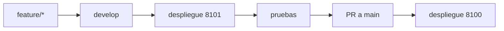

# Despliegue

## Objetivo y política

`git push` solo publica cambios en GitHub; no actualiza servidores. El
comando de desarrollo descarga `origin/develop` en 8101; el de producción
requiere promoción a `main` y descarga `origin/main` en 8100. No modifique
producción manualmente ni se despliega automáticamente desde un PR.



## Entornos

Producción: `/opt/netdoc-prod`, `main`, `netdoc-prod`, 8100 y `http://127.0.0.1:8100/login`. Desarrollo: `/opt/netdoc-dev`, `develop`, `netdoc-dev`, 8101 y `http://127.0.0.1:8101/login`.

## Prerrequisitos e instalación

En cada entorno debe existir repositorio, `.env`, `.venv`, `origin` y el
servicio. Instale desde un checkout confiable:

```bash
install -m 750 scripts/netdoc-deploy-dev /usr/local/sbin/netdoc-deploy-dev
install -m 750 scripts/netdoc-deploy-prod /usr/local/sbin/netdoc-deploy-prod
```

Ejecute como root: `netdoc-deploy-dev`; para producción,
`netdoc-deploy-prod` y confirme `DESPLEGAR`, o use `netdoc-deploy-prod --yes`
solo en automatización controlada.

## Flujo, verificación y rollback

Los scripts verifican directorio, Git, rama, `.env`, `.venv`, servicio y remoto;
hacen `fetch` y `reset --hard` a la rama remota, instalan desde
`requirements-lock.txt`, compilan, importan, reinician solo su servicio y
aceptan HTTP 200/3xx en `/login`. No usan `git clean` ni muestran/modifican
`.env`. Ante fallo restauran el commit previo, reinstalan dependencias y
reinician. Revise `systemctl status`, `journalctl` y el HTTP final.

Rollback manual: en el directorio del entorno, identifique el commit previo,
`git reset --hard <commit>`, reinstale dependencias, reinicie **solo** el
servicio del entorno y compruebe `/login`. La instalación anterior
`/opt/netbox-documental` es respaldo temporal, no producción activa; recuperar
su uso exige procedimiento y decisión formal.

Errores frecuentes: rama incorrecta, remoto ausente, `.env`/`.venv` ausente,
servicio inactivo, dependencia o respuesta HTTP fallida. Antes de producción:
PR revisado, desarrollo probado, secretos revisados, commit identificado y
rollback preparado. Después: servicio activo, login HTTP, logs y commit/rama.
